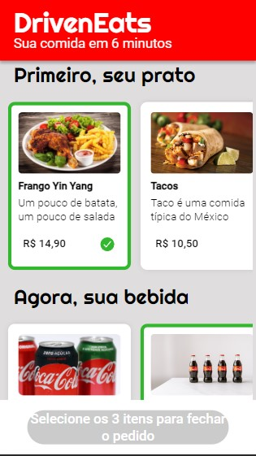
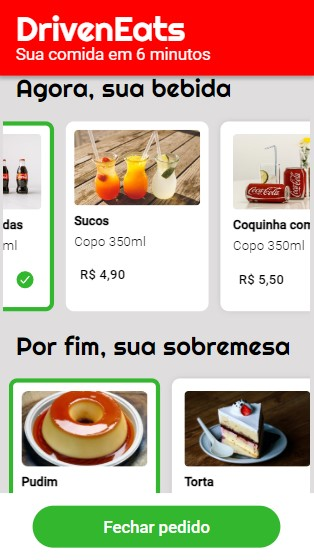
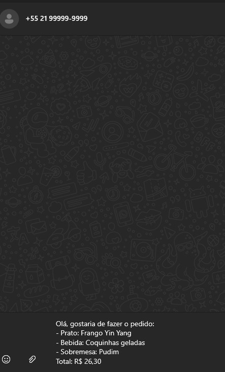

# Driven Eats

https://github.com/LsBDev/Driveneats/blob/main/LICENSE

O DrivenEats é um webapp intuitivo que permite que você escolha seus pratos, bebidas e sobremesas favoritas e efetue pedidos diretamente pelo WhatsApp. Com uma interface simples e eficaz, você pode personalizar seu pedido, revisá-lo e enviá-lo para a loja, tudo em questão de minutos.

<a href="https://driveneats-orpin.vercel.app/"> Link para a Aplicação </a>

  
  
  

## Funcionalidades Principais
 
### Seleção do prato, bebida e sobremesa: 
Simple e fácil, escolha o combo que desejar.

### Confirmação do pedido: 
Após escolhido seu combo, envie o pedido e tenha uma conversa iniciada com o whatsapp da loja.

## Tecnologias Usadas  
  
  
  
  
  
  
  
## Como rodar
Baixe o projeto e abra o arquivo html no navegador de sua preferência.
